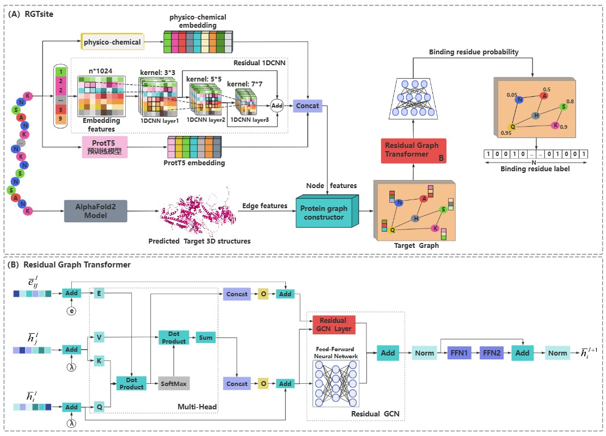
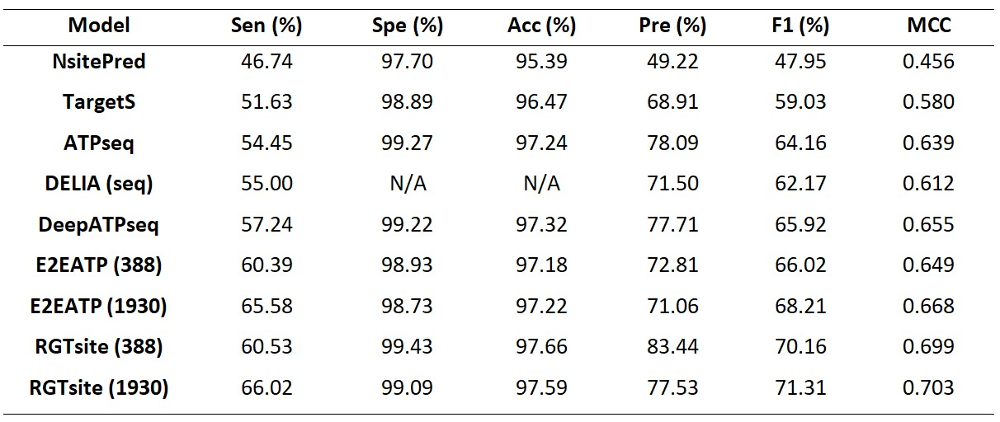
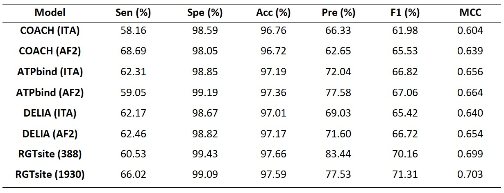
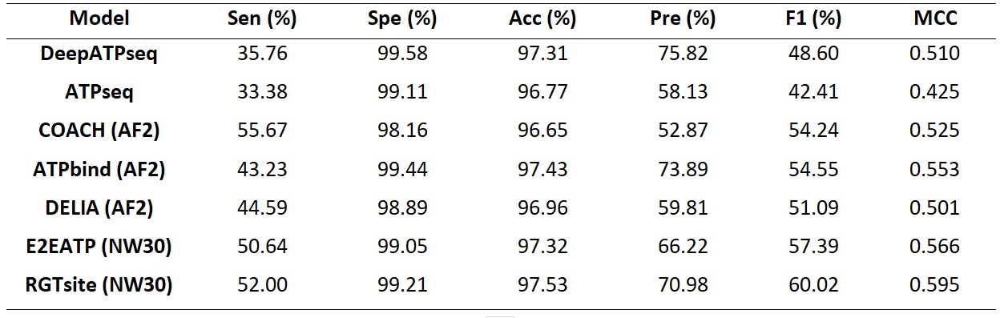
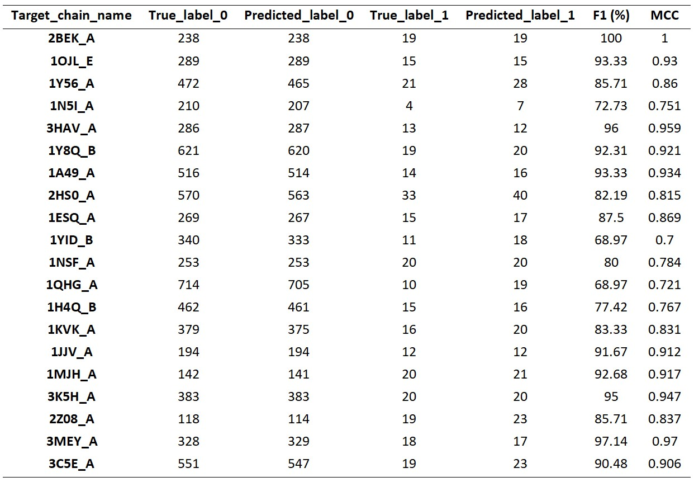
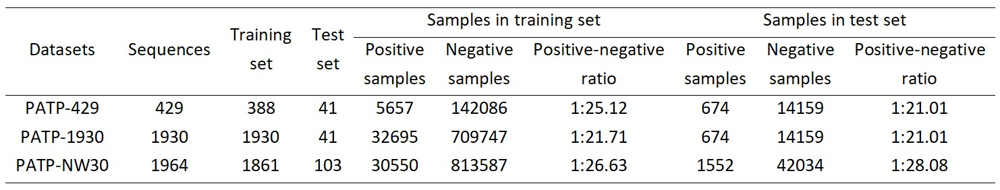

# Improving identification of drug-target binding sites based on structure-aware of target using Residual Graph Transformer Networks

## 🚀 Introduction (RGTSite)

**Improving identification of drug-target binding sites** can significantly aid in drug screening and design, thereby accelerating the drug development process. However, due to challenges such as **insufficient fusion of multimodal information from targets** and **imbalanced datasets**, enhancing the performance of **drug-target binding sites prediction models** remains exceptionally difficult. Leveraging structure-aware of targets, we proposed **a novel deep learning framework**, **RGTsite**, which employed a **Residual Graph Transformer Network** to improve the identification of drug-target binding sites. First, a **residual 1D convolutional neural network (1D-CNN)** and the **pre-trained model ProtT5** were used to extract the **local and global features** from target sequences, respectively. These features were then combined with the **physicochemical properties of amino acid residues** to serve as vertex features in graph. Next, the **edge features** were incorporated, and the residual graph transformer network was applied to extract more comprehensive **vertex features**. Finally, a fully connected network was used to classify whether the vertex was a binding site. Experimental results showed that RGTsite outperformed the existing state-of-the-art methods in key evaluation metrics, such as **F1-score (F1)** and **Matthews Correlation Coefficient (MCC)**, across **multiple benchmark datasets**. Additionally, we conducted **interpretability analysis** for RGTsite through **the real-world cases**, and the results confirmed that RGTsite can **effectively identify drug-target binding sites** in practical applications.

In this study, we proposed a **drug-target binding sites identification model** , **RGTsite** , based on a **graph transformer network architecture**. The input to **RGTsite** consisted of three components: **target chain graph, vertex features, and edge features**. We focus on using **end-to-end methods** to **identify drug-target binding sites**, and the overall framework is illustrated in the figure below.



## 📑 Results

### Paper Results

In this section, we evaluated the performance of **RGTsite** by comparing it with **existing state-of-the-art methods** for **predicting protein-ATP binding sites**, both **sequence-based** and **structure-based**.
Sequence-based methods included **NsitePred**, **Target S**, **ATPseq**, **DELIA (seq)**, **DeepATPseq**, and **E2EATP (388, 1930)**. Among these, **DELIA (seq)** referred to DELIA trained only on sequence-based features, and **E2EATP (388, 1930)** represented the versions of **E2EATP** trained on the **PATP-388** and **PATP-1930** training sets, respectively. We compared the performance of these methods against **RGTsite** on the **PATP-TEST** test set. To provide a **comprehensive evaluation**, we also assessed **RGTsite** trained on two **different training sets—PATP-388 and PATP-1930 (i.e., RGTsite (388) and RGTsite (1930))**, and compared their performance with the aforementioned **state-of-the-art** methods. Experimental results showed that **RGTsite (388)** outperformed **NsitePred, Target S, ATPseq, DELIA (seq), DeepATPseq, and E2EATP (388)** with the same training set across all evaluation metrics. 



Structure-based methods included **COACH (ITA, AF2)**, **ATPbind (ITA, AF2)**, and **DELIA (ITA, AF2)**, where **ITA** and **AF2** indicated that the **target 3D structures** required for these methods were derived from the **structure prediction tools I-TASSER** and **AlphaFold2**, respectively. The independent test set used by both these methods and **RGTsite** was **PATP-TEST**. In the comparative experiment with **structure-based methods**, all **target 3D structures** for **RGTsite** were sourced from **AlphaFold2’s predicted results**, without using **experimentally-determined 3D structures**. This approach was also designed to provide services for **targets lacking experimental 3D structures**. Experimental results revealed that **RGTsite (388)** outperformed existing **structure-based state-of-the-art** methods across all evaluation metrices, except for Sen.



To further comprehensively evaluate the performance of **RGTsite**, we compared it with a series of **state-of-the-art sequence-based methods (e.g., DeepATPseq, ATPseq, E2EATP (NW30))** and **structure-based methods (e.g., COACH (AF2), ATPbind (AF2), DELIA (AF2))** using the independent test set **PATP-NW30-TEST**. Both **E2EATP (NW30)** and **RGTsite (NW30)** were trained on the **PATP-NW30-TRAIN** dataset, while the experimental results of other methods were cited from **E2EATP**. As shown in the results, **RGTsite (NW30)** achieved the **highest F1 and MCC** among all methods, with improvements of **2.63%** and **5.12%**, respectively, compared to the **top-performing method**. Furthermore, **RGTsite's performance** across other metrics also reached levels comparable to the **best values**. Overall, **RGTsite’s excellent performance** on **PATP-NW30** demonstrated that the **residual graph transformer-based** approach effectively extracted the key features influencing **vertex (amino acid residue) classification** across different datasets. This **highlighted RGTsite’s strong vertex classification capabilities**, making it suitable for analysis tasks on **complex datasets**.



To evaluate the performance of RGTsite in **practical applications**, we randomly selected 20 target chains from the dataset used by the **state-of-the-art method ATP-Deep** and constructed the **PATP_20 dataset**. All chains in this dataset were **excluded from any benchmark sets** used in this study. 



## 🛫 Requirement

### Conda Enviroment

Please make sure you have installed **[Anaconda3](https://www.anaconda.com/download)** 

**If you already have a enviroment.**

We recommend that the `torch_geometric` should been updated to 2.3.1 or higher.

**If you don't have a enviroment.**

```shell
conda env create -f environment.yaml
conda activate protssn
pip install torch_scatter torch_sparse torch_cluster -f https://data.pyg.org/whl/torch-2.3.1+cu121.html
```

### Hardware

- For direct use of **model**, we recommend at least **10G** of memory, such as RTX 3080
- For **retraining** a MM-IDTarget, we recommend that the larger the memory. We recommend a **24GB** RTX 4090 or better.


## ✏️ Pre-train From Scratch

### 1.Download Pre-train Dataset or Work with datasets

In this study, we employed three standard datasets(https://github.com/dldxzx/RGTsite/data/*.csv) , including **PATP-429**, **PATP-1930**, and **PATP-NW30**. These datasets consisted of **target sequences bound to ATP (Adenosine triphosphate)**, and these sequences were sourced from **Protein Data Bank (PDB)**, with variations in data collection years and preprocessing methods. As of November 5, 2016, **PATP-429** was constructed, containing 429 sequences. Redundant sequences with **greater than 40% sequence consistency** were removed using **CD-HIT tool**. The training set, **PATP-388**, consisted of 388 sequences, including **5657 ATP binding sites** and **142086 non-binding sites**. The test set, **PATP-TEST**, contained 41 sequences, with **674 ATP binding sites** and **14159 non-binding sites**. By June 23, 2023, **NW-Align tool** was used to **cluster sequences at 40% sequence identity**, resulting in the creation of **PATP-1930**. This dataset included 1930 sequences, **32695 ATP binding sites**, and **709747 non-binding sites**. PATP-1930 was utilized solely as a training set, while **PATP-TEST** remained its test set. Additionally, using **NW-Align with a 30% sequence identify** threshold, **PATP-NW30** was generated. The dataset was further split into a training set, **PATP-NW30-TRAIN**, which contained 1861 sequences, **30550 ATP binding sites**, and **813587 non-binding sites**, and a test set, **PATP-NW30-TEST**, which included 103 sequences, **1552 ATP binding sites**, and **42034 non-binding sites**. As shown in image, there were **significant differences** in the **positive-to-negative sample ratios** in the **training and test sets** across **PATP-429**, **PATP-1930**, and **PATP-NW30**, all of which were **typical imbalanced datasets**.



### 2.Build Target and Drug Graph and save multi-signature PT files

You can construct the **target graph**, and then we can separately **extract the node and edge features**. Next, save the **target graph** and the **sequence features extracted from the pre-trained model** into a **PT file** for future use. Finally, based on the **training and testing sets**, save the **label-encoded sequence features** of the corresponding targets, the **target graph features** in the PT file, and the **sequence features extracted from the pre-trained model** into a complete PT file.

```bash
# Run the following command. Target Graph
python TargetGraph.py

# Run the following command. Drug Graph
python ProtT5.py

# Run the following command. The dataset is directly generated from the PT files of the training set and the test set
python dataset.py
```

### 3.Start Training

When all the **data is ready**, you can **train your own model** by running the following command.

```bash
# Run the following command. 
python training_388.py
python training_1930.py
python training_nw30.py
```
### 4.Saving Pre-trained Models

Since our **three model training files (RGTsite_388.pkl, RGTsite_1930.pkl, RGTsite_nw30.pkl)** are too large, we are **unable to upload them** to the GitHub repository. 
You can **download them from the following link:** https://pan.baidu.com/s/1i55YjF5f-LY_KgA1aByEdQ **Extraction code:** dldx.

## 🙌 Contact

If you have questions or suggestions, please contact: sgp1811394108@163.com.
